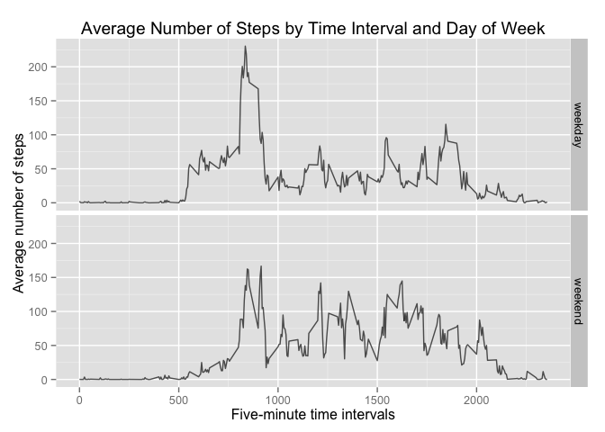

# Reproducible Research: Peer Assessment 1
###14 Dec 2014
***

## Loading and preprocessing the data
First, let's read the data that was downloaded from https://d396qusza40orc.cloudfront.net/repdata%2Fdata%2Factivity.zip then tidy the data for this analysis.

```r
# Read data
data <- read.csv("activity.csv")

# Convert date column from Factor type to Date type
data$date <- as.Date(data$date, "%Y-%m-%d")

# Convert interval column to a factor
data$interval <- as.factor(data$interval)
```

Let's preview the strucure of the dataset

```r
str(data)
```

```
## 'data.frame':	17568 obs. of  3 variables:
##  $ steps   : int  NA NA NA NA NA NA NA NA NA NA ...
##  $ date    : Date, format: "2012-10-01" "2012-10-01" ...
##  $ interval: Factor w/ 288 levels "0","5","10","15",..: 1 2 3 4 5 6 7 8 9 10 ...
```


***
## What is mean total number of steps taken per day?
Ignoring all the NA values, the function tapply is used to find out the total number of steps taken each day. The first 6 rows of the results are being previewed.

```r
dataClean <- data[complete.cases(data), ]

# Use tapply to find the total number of steps each day
totalSteps <- as.data.frame(tapply(dataClean$steps, dataClean$date, sum, na.rm=TRUE))
colnames(totalSteps) <- "steps"
head(totalSteps)
```

```
##            steps
## 2012-10-02   126
## 2012-10-03 11352
## 2012-10-04 12116
## 2012-10-05 13294
## 2012-10-06 15420
## 2012-10-07 11015
```

The following histogram plots the total number of steps taken each day. The mean and median values are computed.

```r
# Plot the data in a histogram
hist(totalSteps$steps, breaks=10, col="steelblue", main="Total Number of steps each day", xlab="Total Number of Steps", ylab = "Frequency (Number of Days)")

# Compute the mean and median values and round them to 2 decimal places
meanTotalSteps <- mean(totalSteps$steps, na.rm = TRUE)
meanTotalSteps <- format(round(meanTotalSteps, 2), nsmall = 2)

medianTotalSteps <- median(totalSteps$steps, na.rm = TRUE)
medianTotalSteps <- format(round(medianTotalSteps, 2), nsmall = 2)

# Add mean and median lines to the plot
abline(v = meanTotalSteps, col = "red", lwd = 2)
abline(v = medianTotalSteps, col = "green", lwd = 2)

# Add a legend to the plot
legend("topright", c("mean value", "median value"), col=c("red", "green"), lwd=2)
```

 

The mean total number of steps taken per day is **10766.19** and the median total number of steps taken per day is **10765.00**.

***
## What is the average daily activity pattern?
Ignoring all the NA values, the function tapply is used to find out the average number of steps taken grouped by interval. The first 6 rows of the results are being previewed.

```r
# Use tapply to find the average number of steps grouped by interval
avgStepsByInterval = as.data.frame(tapply(dataClean$steps, dataClean$interval, mean, na.rm=TRUE))
colnames(avgStepsByInterval) <- "steps"
head(avgStepsByInterval)
```

```
##        steps
## 0  1.7169811
## 5  0.3396226
## 10 0.1320755
## 15 0.1509434
## 20 0.0754717
## 25 2.0943396
```

The following graph should the average number of steps taken grouped by the 5-minute interval. 

```r
plot(rownames(avgStepsByInterval), avgStepsByInterval$steps, type = "l", xlab = "Five-minute time intervals", ylab = "Average number of steps", main = "Average Number of Steps by Time Interval")
```

 

From the graph, it is seen that the average number of steps taken by interval peaks in between the 500 and 1000 five-minute intervals.

```r
maxSteps <- max(avgStepsByInterval$steps, na.rm=TRUE)
maxSteps <- format(round(maxSteps, 2), nsmall = 2)

intervalMaxSteps <- rownames(avgStepsByInterval)[which.max(avgStepsByInterval$steps)]
```
The maximum number of steps taken across all intervals is **206.17** and this happens at the interval **835**.


***
## Inputing missing values
Let's preview the original data frame with NAs and count the total number of missing values

```r
totalMissing <- sum(is.na(data))
head(data)
```

```
##   steps       date interval
## 1    NA 2012-10-01        0
## 2    NA 2012-10-01        5
## 3    NA 2012-10-01       10
## 4    NA 2012-10-01       15
## 5    NA 2012-10-01       20
## 6    NA 2012-10-01       25
```

There are a total of **2304** missing values. Now, the dataset is replicated and the missing values are populated with the average number of steps for that particular interval using a for loop.


```r
# Replicate the original dataset for further work
dataComplete <- data

# Run a loop to populate missing values with the average number of steps for that particular interval
for (i in (1:nrow(dataComplete))) {
    if (is.na(dataComplete$steps[i])) {
        dataComplete$steps[i] <- avgStepsByInterval$steps[dataComplete$interval[i]]
    }
}
```

Let's preview the data after inputting the missing values

```r
totalMissingComplete <- sum(is.na(dataComplete))
head(dataComplete)
```

```
##       steps       date interval
## 1 1.7169811 2012-10-01        0
## 2 0.3396226 2012-10-01        5
## 3 0.1320755 2012-10-01       10
## 4 0.1509434 2012-10-01       15
## 5 0.0754717 2012-10-01       20
## 6 2.0943396 2012-10-01       25
```

There are a total of **0** missing values in the complete dataset.   

The function tapply is used again to find out the total number of steps taken each day based on this complete dataset. The first 6 rows of the results are being previewed.

```r
# Use tapply to find the total number of steps each day
totalStepsComplete <- as.data.frame(tapply(dataComplete$steps, dataComplete$date, sum, na.rm=TRUE))
colnames(totalStepsComplete) <- "steps"
head(totalStepsComplete)
```

```
##               steps
## 2012-10-01 10766.19
## 2012-10-02   126.00
## 2012-10-03 11352.00
## 2012-10-04 12116.00
## 2012-10-05 13294.00
## 2012-10-06 15420.00
```

The following histogram plots the total number of steps taken each day for the complete dataset. The mean and median values are computed.

```r
# Plot the data in a histogram
hist(totalStepsComplete$steps, breaks=10, col="steelblue", main="Total Number of steps each day (complete)", xlab="Total Number of Steps", ylab = "Frequency (Number of Days)")

# Compute the mean and median values and round them to 2 decimal places
meanTotalStepsComplete <- mean(totalStepsComplete$steps, na.rm = TRUE)
meanTotalStepsComplete <- format(round(meanTotalStepsComplete, 2), nsmall = 2)
medianTotalStepsComplete <- median(totalStepsComplete$steps, na.rm = TRUE)
medianTotalStepsComplete <- format(round(medianTotalStepsComplete, 2), nsmall = 2)

# Add mean and median lines to the plot
abline(v = meanTotalStepsComplete, col = "red", lwd = 2)
abline(v = medianTotalStepsComplete, col = "green", lwd = 2)

# Add a legend to the plot
legend("topright", c("mean value", "median value"), col=c("red", "green"), lwd=2)
```

 

The mean total number of steps taken per day is **10766.19** and the median total number of steps taken per day is **10766.19**.  

Comparing these with the original values of **10766.19** and **10765.00** correspondingly, there does not seem to be a significant impact inputing missing data on the estimates.

***
## Are there differences in activity patterns between weekdays and weekends?
Using the complete dataset (with estimates replacing the NA values), add a new column to identify if a given day is a weekday or a weekend.

```r
# Identify weekends by checking if the first alphabet is an S or s
weekendsIndex <- grepl("^[Ss]", weekdays(as.Date(dataComplete$date)))

# Populate the dayOfWeek column
for (i in (1:nrow(dataComplete))) {
    if (weekendsIndex[i] == TRUE) {
        dataComplete$dayOfWeek[i] <- "weekend"
    } else {
        dataComplete$dayOfWeek[i] <- "weekday"
    }
}

# Convert dayOfWeek column to a factor
dataComplete$dayOfWeek <- as.factor(dataComplete$dayOfWeek)
```

Let's preview the structure of this new dataset.

```r
str(dataComplete)
```

```
## 'data.frame':	17568 obs. of  4 variables:
##  $ steps    : num  1.717 0.3396 0.1321 0.1509 0.0755 ...
##  $ date     : Date, format: "2012-10-01" "2012-10-01" ...
##  $ interval : Factor w/ 288 levels "0","5","10","15",..: 1 2 3 4 5 6 7 8 9 10 ...
##  $ dayOfWeek: Factor w/ 2 levels "weekday","weekend": 1 1 1 1 1 1 1 1 1 1 ...
```

Aggregate the data and take the average number of steps taken by interval and day of week. 

```r
# Aggregate data
meanByDayOfWeek <- aggregate(dataComplete$steps, by = list(dataComplete$interval, dataComplete$dayOfWeek), FUN = "mean", na.rm = TRUE)

# Set column names
colnames(meanByDayOfWeek) <- c("interval", "dayOfWeek","steps")

# Sort the data by interval to see clearly the values of each interval by weekday or weekend
meanByDayOfWeek <- meanByDayOfWeek[order(as.numeric(meanByDayOfWeek$interval)), ]
```

Note that the interval column needs to be converted to numeric values in order to plot it as a sequential value in the x-axis later on. Let's preview the final result.

```r
meanByDayOfWeek$interval <- as.numeric(as.character(meanByDayOfWeek$interval))
head(meanByDayOfWeek)
```

```
##     interval dayOfWeek      steps
## 1          0   weekday 2.25115304
## 289        0   weekend 0.21462264
## 2          5   weekday 0.44528302
## 290        5   weekend 0.04245283
## 3         10   weekday 0.17316562
## 291       10   weekend 0.01650943
```

Now, let's plot the results using the ggplot2 library. The graph for weekday and weekend are in 2 panels.

```r
library(ggplot2)
# Plot the answer
g <- ggplot(meanByDayOfWeek, aes(interval, steps))
p <- g + 
  geom_line(alpha=2/3) + 
  facet_grid(dayOfWeek ~ .) + 
  labs(x = "Five-minute time intervals") +
  labs(y = "Average number of steps") +
  labs(title = expression("Average Number of Steps by Time Interval and Day of Week"))
print(p)
```

 

Based on the graph plotted, it can be observed that the overall daily activity is higher on weekends. On both weekdays and weekends, the activity peaks in between the intervals 500 and 1000. This may be because that is the usual period the subject starts the day by leaving the house and which requires the most walking.  

On weekdays, the second peak happens towards the end of the day which may suggest that it is the period the subject usually returns home. The activity remains low for all other periods of the day. The subject probably holds a desk-bound job.  

On weekends, the subject is active throughout the day he/she is awake. It is also observed that the activity starts more gradually at the beginning of the day as compared to weekdays, and tapers off at a later time at the end of the day as compared to weekdays.  
